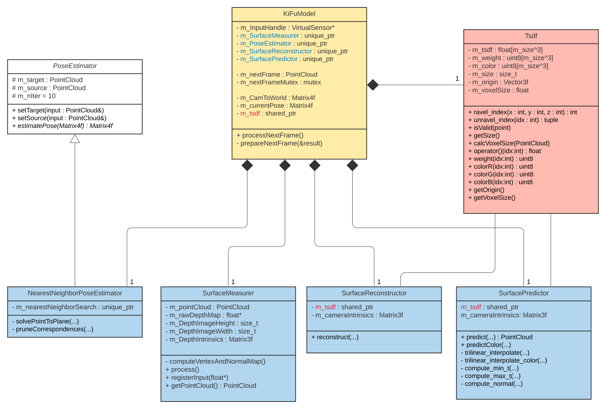
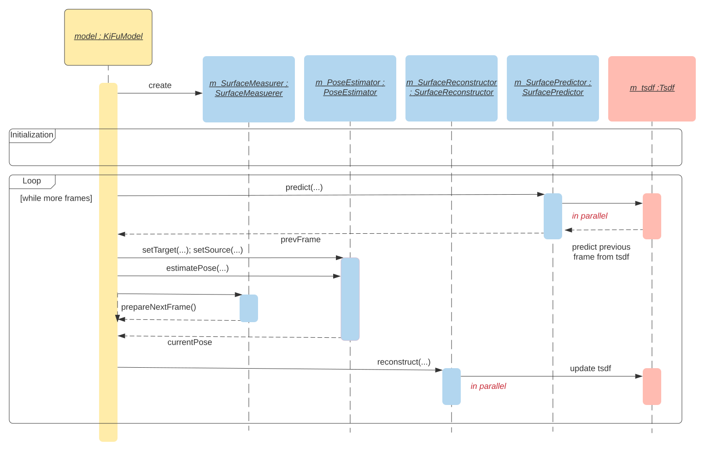

# KiFu (CPU)
Under construction.
Implements KincetFusion in C++, accelerated with OpenMP on CPU.

## References
1 [KinectFusion: Real-Time Dense Surface Mapping and Tracking](https://www.google.com/url?sa=t&rct=j&q=&esrc=s&source=web&cd=&cad=rja&uact=8&ved=2ahUKEwi7w_27mvLsAhXuILcAHWdZDHwQFjAAegQIAxAC&url=https%3A%2F%2Fwww.microsoft.com%2Fen-us%2Fresearch%2Fwp-content%2Fuploads%2F2016%2F02%2Fismar2011.pdf&usg=AOvVaw3uHY0TJIr3p57KW4p52rtC)

2 [KinectFusion: Real-time 3D Reconstruction and Interaction Using a Moving Depth Camera](https://www.microsoft.com/en-us/research/publication/kinectfusion-real-time-3d-reconstruction-and-interaction-using-a-moving-depth-camera/)

## Most important classes

## Illustration of main worker loop

